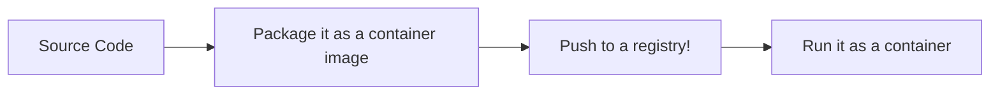

#docker #devops #container 

> [!info] Related Notes
> [[Setup Docker|Docker Setup Guide]]
[Docker Playground](https://labs.play-with-docker.com/)

- Docker is language agnostic

## Basic Workflow

![[../assets/Pasted image 20250331155237.png]]
## Docker file
- Set of build instructions for docker to follow to build the app and its dependencies into a container image
- [[../../Glossary/Docker Glossary#Docker|Container Image]] definition
- Sample dockerfile
```dockerfile
# Simple Python Application Dockerfile
FROM python:3.11-slim

# Set working directory
WORKDIR /app

# Copy requirements file and install dependencies
COPY requirements.txt .
RUN pip install --no-cache-dir -r requirements.txt

# Copy application code
COPY . .

# Expose port
EXPOSE 8000

# Run the application
CMD ["python", "app.py"]

```

## Building the image
```bash
# Build a Docker image and push to Docker Hub
docker image build -t shreyak19/myapp:1.0 .
```
![[../assets/Pasted image 20250331164154.png]]
> [!info]  Command Breakdown
> - `docker image build`: The base command to build a Docker image
> - `-t shreyak19`: Tags the image with your username
> -  `/myapp`: the name of the repository containing src code
> -  `:1.0`: Name of the image - normally going to be some sort of version
> - `.`: Specifies the build context (Tells docker tat everything you need is in the directory where this command is executing - current directory containing your Dockerfile)

- Image will be built then, however, it is landlocked on the local computer
- However, to host it and make it accessible to different environments, we use doker hub respository
## Pushing to Docker Hub
- Docker Hub are also called OCI registries
- There are multiple container registries - google's, AWS, Azure, Red Hat etc.
- We can also host one on our own private cloud or on-premises

```bash
# push to Docker Hub
docker image push shreyak19/myapp:1.0 .
```

---

## Accessing Local files from a container - developing while hosting
- Docker isolates all content, code, and data in a container from your local filesystem.Sometimes you may want the container to access a directory on your system. This is when you use bind mounts.
	- If you want to access data on your system, you can use a bind mount. A bind mount lets you share a directory from your host's filesystem into the container. `
```yaml
    volumes:
      - ./app:/usr/src/app
      - /usr/src/app/node_modules>)
```

- The **volumes** element tells Compose to mount the local folder **./app** to **/usr/src/app** in the container for the **todo-app** service. This particular bind mount overwrites the static contents of the **/usr/src/app** directory in the container and creates what is known as a development container. The second instruction, **/usr/src/app/node_modules**, prevents the bind mount from overwriting the container's **node_modules** directory to preserve the packages installed in the container.
- Now, you can take advantage of the container’s environment while you develop the app on your local system. Any changes you make to the app on your local system are reflected in the container. save the file. Visit or refresh [localhost:3001⁠](http://localhost:3001/ "http://localhost:3001") to see the changes.
## How to containerize my app
When working with containers, you usually need to create a **Dockerfile** to define your image and a **[[Remote-hub/Docker/compose file|compose]].yaml** file to define how to run it.

To help you create these files, Docker has a command called ``docker init``. Run this command in a project folder, and Docker will create all the required files needed. It will also prompt some questions to configure your project correctly.

Once you have answered all the questions, you may run **docker compose up** to run your project.

There is a chance, however, that the **Dockerfile** and **compose.yaml** file created for your project need additional changes. In this case, you may need to look up the [Dockerfile reference⁠](https://docs.docker.com/engine/reference/builder/ "https://docs.docker.com/engine/reference/builder/") and [Compose file reference⁠](https://docs.docker.com/compose/compose-file/ "https://docs.docker.com/compose/compose-file/") in our documentation. We try our best to do the heavy lifting for you, but sometimes there's some assembly required.

## How to publish our image
