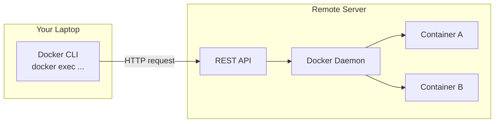
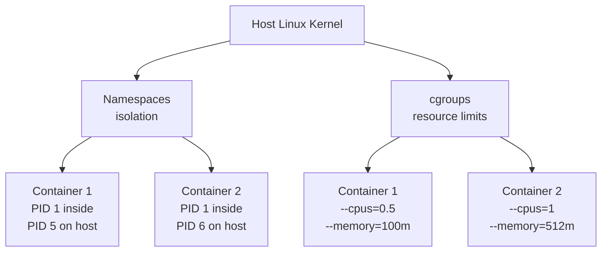
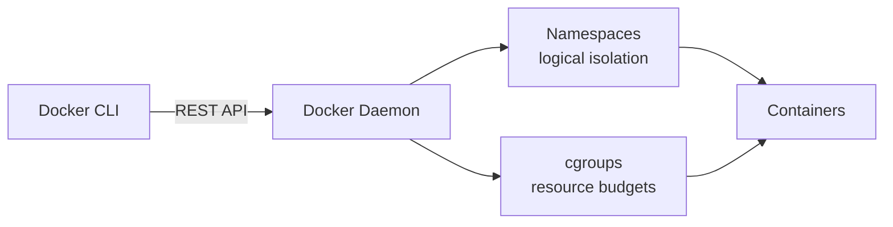

← [[HOME|Home]] &nbsp;·&nbsp; [[Docker MOC]]

#docker #devops #container

> [!info] Related Notes
> [[Docker Basics]] · [[Docker Commands]] · [[Docker Networking]]

---

## What is Docker Engine?

Docker Engine = a host with Docker installed. It's the runtime that actually runs containers.

When you install Docker on a Linux host, you install **three distinct pieces**:
![[Pasted image 20260512181602.png]]
```
┌─────────────────────────────────────────┐
│              Docker Engine              │
│                                         │
│  ┌─────────┐  REST  ┌────────────────┐  │
│  │  CLI    │ ──────▶│   Daemon       │  │
│  │(docker) │  API   │ (dockerd)      │  │
│  └─────────┘        └────────────────┘  │
│                      manages:           │
│                      images, containers │
│                      volumes, networks  │
└─────────────────────────────────────────┘
```

| Component | What it is |
|---|---|
| **Docker Daemon** (`dockerd`) | Background process — manages images, containers, volumes, networks |
| **REST API** | The interface programs use to talk to the daemon |
| **Docker CLI** | The `docker` command you type — sends requests to the REST API |

---

## CLI and Daemon Don't Have to Be on the Same Machine

The CLI talks to the daemon via REST API — so the CLI can point at a **remote** daemon:

```bash
docker -H=10.123.2.1:2375 run nginx
# or set it permanently:
export DOCKER_HOST=tcp://10.123.2.1:2375
docker exec -it <container_id> /bin/bash   # now talks to the remote daemon
```



### If you have Docker Desktop

All three components live on your laptop. Docker Desktop is a GUI wrapper that installs and manages the daemon for you — the whale icon in your menu bar **is** the daemon running.

```
Your laptop:
  Terminal (CLI)  →  REST API  →  Daemon  →  Containers
```

> Docker Hub is completely separate — it's just a registry (like GitHub but for images). Nothing to do with the daemon.

---

## Real-World: Execs Into Remote Containers

When you run `docker exec -it <container_id> /bin/bash`, your CLI sends that command via the REST API to the daemon on whichever host the container is running on. The daemon handles getting you inside.

At Sonic this surfaces as:

| Tool | What's actually happening |
|---|---|
| **Freelens → Terminal** | `kubectl exec -it <pod> -- /bin/bash` to a daemon on a cluster node |
| **Freelens → Logs** | `kubectl logs <pod>` to the same remote daemon |
| **Direct `docker exec`** | CLI → REST API → remote daemon → container shell |

The mental model is always the same: your local CLI, remote daemon.

### Common things to check once you're inside

```bash
# environment & config
env                              # are env vars what you expect?
cat /app/config/settings.yml     # is this the right config for this env?
cat /run/secrets/db_password     # did the secret mount correctly?

# network & connectivity
curl -v https://internal-endpoint.sonic.com   # full TLS handshake
nc -zv db-host 5432              # can I reach the DB port?
nslookup internal-service        # is DNS resolving inside the container?

# certificates (relevant for Zscaler)
ls /etc/ssl/certs/               # is the CA cert injected?
openssl s_client -connect host:443

# process & resource
ps aux                           # what's actually running?
top                              # is something eating CPU?
cat /var/log/app/error.log       # app-level logs
```

---

## How Docker Isolates Containers

Docker uses two Linux kernel features:
![[Pasted image 20260512181545.png]]



### Namespaces — Isolation

Each container gets its own **PID namespace**, making it believe it's an independent system.

**How PID remapping works:**

```
Host PID table          Container view
-----------             ---------------
PID 1  = init           Container A:
PID 2  = kernel           PID 1 = my-app   (actually PID 5 on host)
PID 5  = my-app
PID 6  = other-app      Container B:
                          PID 1 = other-app  (actually PID 6 on host)
```

Key point: **containers are not VMs.** The processes run directly on the host kernel — they're just logically partitioned. No extra OS overhead.

### cgroups — Resource Limits

Without limits, one container could eat all host CPU/RAM. cgroups let you cap it:

```bash
docker run --cpus=0.5 --memory=100m nginx
#           ↑ max 50% CPU   ↑ max 100 MB RAM
```

The limits are enforced by the **kernel**, not Docker itself.

---

## Summary



| Concept | Purpose | Key detail |
|---|---|---|
| Docker Daemon | Manages all Docker objects | Background process, started by Docker Desktop |
| REST API | CLI ↔ Daemon communication | Lets CLI and daemon live on different machines |
| Docker CLI | The `docker` command | Uses REST API under the hood |
| Namespaces | Isolate containers from each other | Processes still run on host kernel |
| cgroups | Limit CPU and memory per container | Kernel-enforced, not Docker-enforced |
