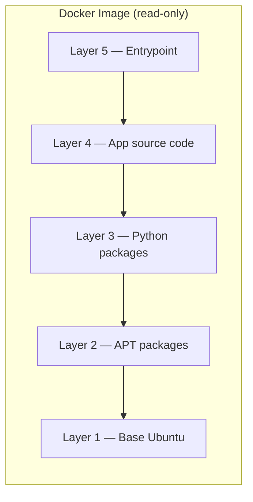
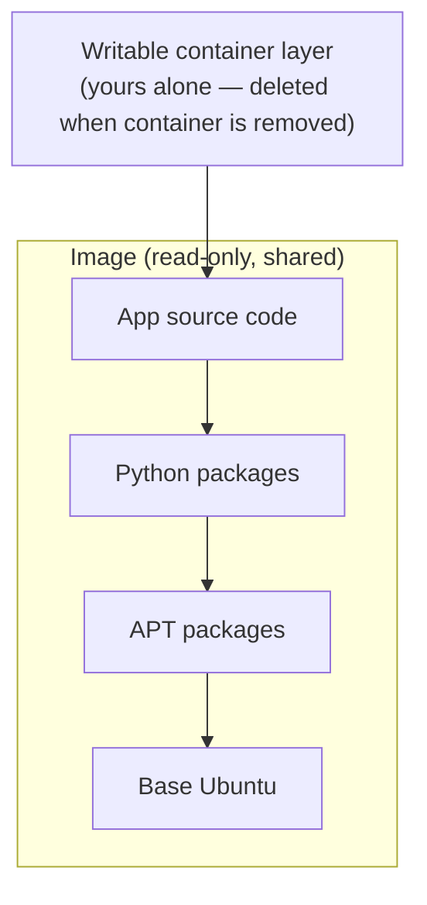
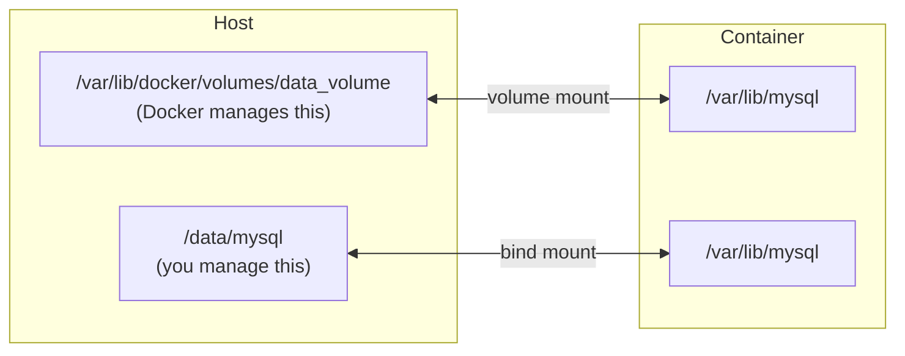

← [[Notes/HOME|Home]] &nbsp;·&nbsp; [[Docker MOC]]

#docker #devops #container

> [!info] Related Notes
> [[Docker Basics]] · [[Docker Engine]] · [[Docker Commands]]

---

## Where Docker Stores Data on the Host

When Docker is installed on Linux, everything lives under `/var/lib/docker/`:

```
/var/lib/docker/
├── containers/   ← one folder per container, named after the container ID
├── image/        ← image metadata
├── volumes/      ← named volumes
└── aufs/         ← image layer data (depends on storage driver)
```

> The folder name inside `containers/` is the same as the container ID you see in `docker ps`.

---

## Layered Architecture

Each instruction in a Dockerfile creates a **layer** — only the changes from the previous step. Layers are cached, so if two images share the same base, Docker stores those shared layers just once on disk.



Two different apps with the same Ubuntu + Python base:
```
App 1:  [Ubuntu] [APT] [Python] [app-1 code]
App 2:  [Ubuntu] [APT] [Python] [app-2 code]
         ↑ stored once on disk ↑
```

---

## Image Layers vs Container Layer

The image layers are **read-only and shared** across every container from that image. When you run a container, Docker adds one thin **writable layer** on top just for that container.



| | Image layers | Container layer |
|---|---|---|
| Access | Read-only | Read-write |
| Shared? | Yes — all containers from this image | No — unique per container |
| Lifetime | Until image is deleted | **Gone when container is removed** |

---

## Copy-on-Write

Containers can't edit files in the read-only image layer directly. If a container tries to, Docker silently **copies that file into the writable container layer first**, then lets you edit the copy. The original image is never touched.

```
Image layer:     app.py  ← read-only, shared
                    ↓  container wants to edit it
Container layer: app.py  ← your edits land here (copy)
```

---

## Volumes — Keeping Data After a Container is Deleted

Since the container layer disappears when the container is removed, use **volumes** for anything that needs to survive — database files, uploads, logs.



---

## Volume Mount vs Bind Mount

> **Analogy:**
> - **Volume** = office filing room. You say "use cabinet #3." Docker handles where it physically lives.
> - **Bind** = you bring a folder from your own desk. You control it, you can edit it from either side.

| | Volume mount | Bind mount |
|---|---|---|
| Who manages the host path | Docker (`/var/lib/docker/volumes/`) | You (any path you choose) |
| Need to specify source? | No — just give it a name | **Yes — always need source + target** |
| Use in | Production (persistent app data) | Dev (live code reload) |
| Works on any machine? | Yes | Only if that path exists on the machine |

### Syntax

**Volume mount:**
```bash
docker run -v data_volume:/var/lib/mysql mysql
#              ↑ name        ↑ where to mount inside container
```

**Bind mount** — source and target are both required, since Docker has no default to fall back on:
```bash
# short form
docker run -v /data/mysql:/var/lib/mysql mysql
#              ↑ source      ↑ target

# explicit form (preferred)
docker run --mount type=bind,source=/data/mysql,target=/var/lib/mysql mysql
```

A bind mount works both ways — the container can read files you put there, and anything the container writes shows up on the host immediately.

### Anonymous Volumes

If you give only a container path with no source:
```bash
docker run -v /var/lib/mysql mysql
```
Docker creates an **anonymous volume** — no name, Docker-managed, but hard to reference later. Good for throwaway containers, not production.

---

## Bind Mounts in Dev — Avoiding Rebuilds

Without a bind mount, every code change means a full rebuild:
```
edit code → docker build → docker run   (×100 per day)
```

With a bind mount, the container reads your files live:
```bash
docker run -v /home/shreya/myapp:/app myapp   # once
# now just edit code — no rebuild needed
```

The container sees your changes instantly because it's reading directly from your host folder.

---

## Storage Drivers

All the layer operations (creating layers, copy-on-write, writable container layer) are handled by a **storage driver**. Docker picks the best one for your OS automatically.

| Driver | Common on |
|---|---|
| `overlay2` | Most modern Linux distros |
| `aufs` | Older Ubuntu |
| `devicemapper` | Systems without AUFS support |

You rarely need to change this.

---

## Summary

| Concept | Key point |
|---|---|
| `/var/lib/docker` | Docker's root data directory on the host |
| `containers/` folder | One subfolder per container, named after the container ID |
| Layered architecture | Each Dockerfile instruction = one layer; cached and reused |
| Image layers | Read-only, shared between all containers from the same image |
| Container layer | Read-write, unique per container, deleted with the container |
| Copy-on-write | File copied to container layer before editing; image untouched |
| Volume mount | Docker manages the path — use for production persistent data |
| Bind mount | You manage the path, needs source + target — use in dev |
| Anonymous volume | No name, no source path — hard to reuse, fine for throwaway containers |
| Storage drivers | Manage all layer operations (overlay2, aufs, devicemapper…) |
